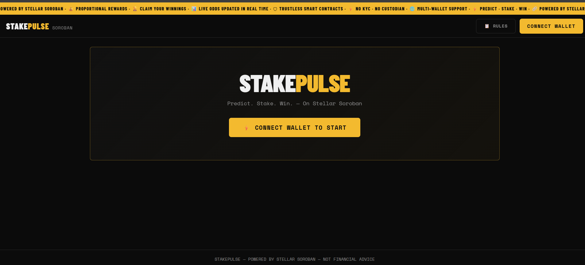
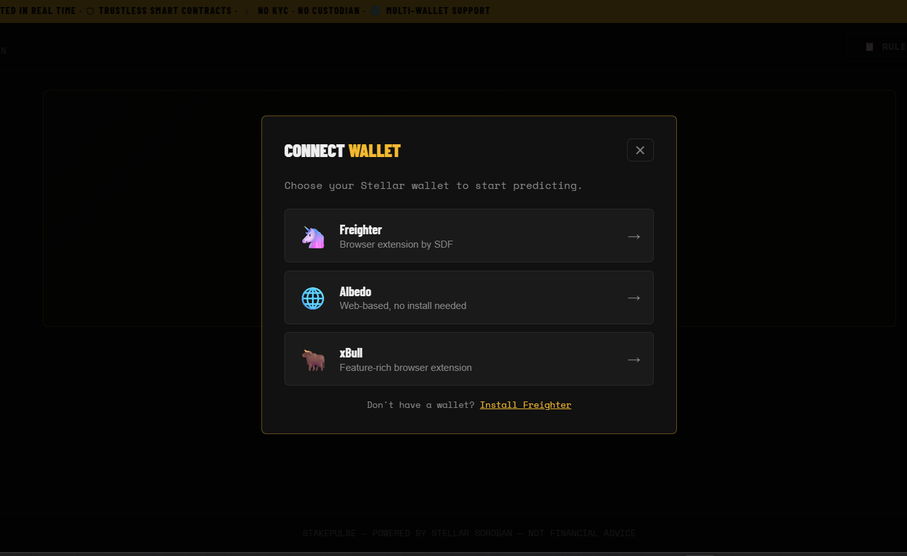
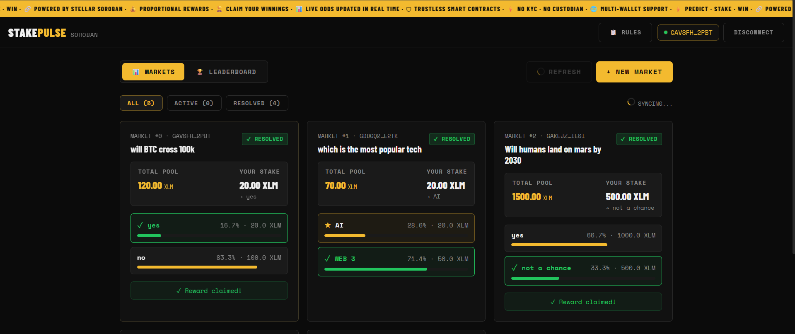
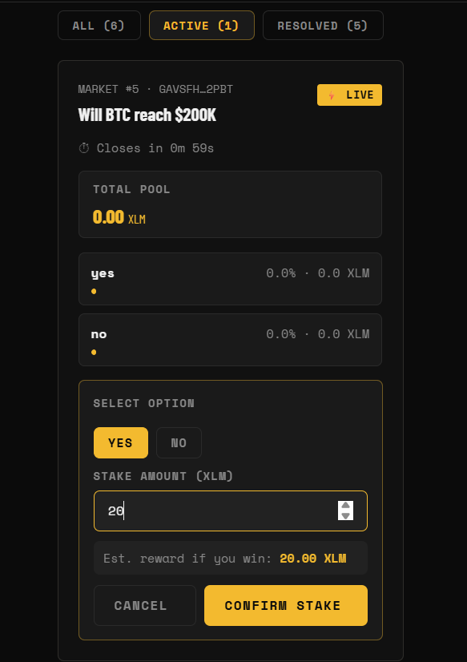
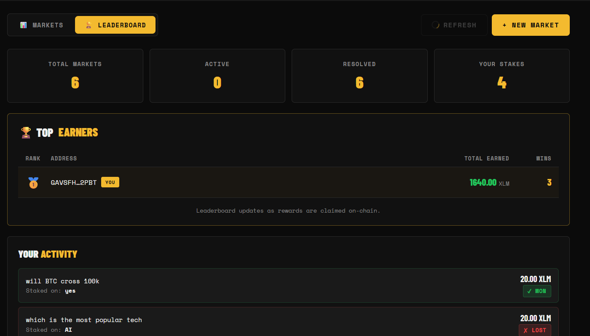
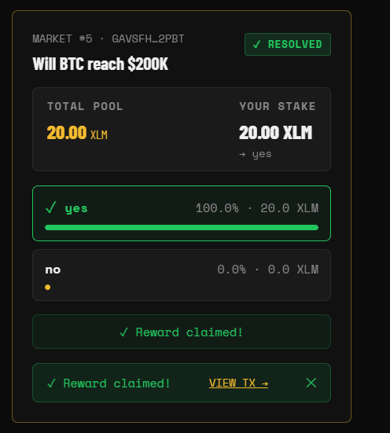
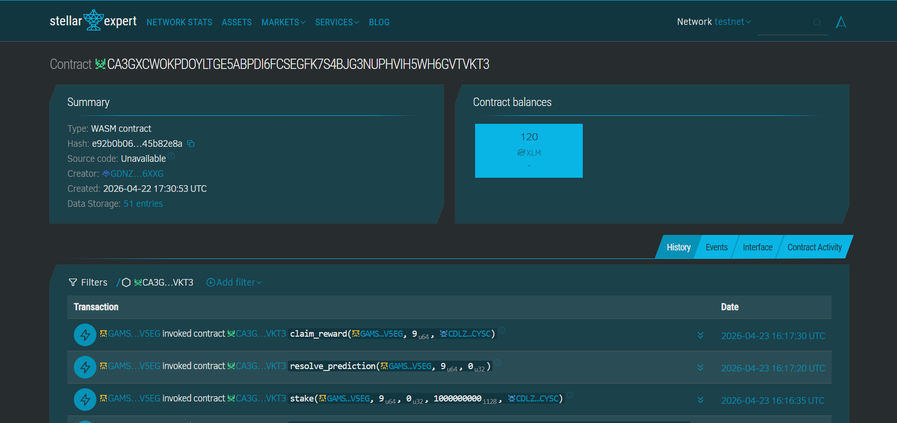
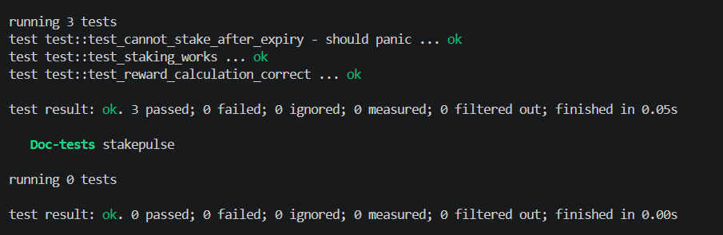

# ⚡ StakePulse

> **Predict. Stake. Win.** — A decentralized prediction market dApp built on Stellar Soroban.

## 🌐 Live Demo

🔗 https://stakepulse-gamma.vercel.app/

---

## 🎥 Demo Video

Click below to watch the full demo:

[](demo/demo_video.mp4)

---

## 📸 Screenshots

### 👛 Multi-wallet Support


### 🏠 Homepage / Markets


### 💰 Stake on Prediction


### 🏆 Leaderboard


### 🎉 Claim Rewards


---

## 🔗 Smart Contract (Deployed on Stellar Testnet)

**Contract ID:**  
`CA3GXCWOKPDOYLTGE5ABPDI6FCSEGFK7S4BJG3NUPHVIH5WH6GVTVKT3`

**Explorer:**  
🔍 https://stellar.expert/explorer/testnet/contract/CA3GXCWOKPDOYLTGE5ABPDI6FCSEGFK7S4BJG3NUPHVIH5WH6GVTVKT3

### 📸 On-chain Verification



---

## 🧪 Test Results

All contract tests passing successfully:



---

## 🧠 What is StakePulse?

StakePulse is a fully on-chain prediction market on the **Stellar Soroban** smart contract platform. Users can:

- **Create** prediction markets with 2–4 options
- **Stake** XLM tokens on their chosen outcome
- **Earn** proportional rewards from the total pool if they pick the winning option
- **Claim** rewards on-chain with a single transaction

All logic runs in a Soroban smart contract — no centralized backend.

---

## ✨ Features

| Feature | Description |
|---|---|
| 🔐 Multi-wallet | Freighter, Albedo, xBull via `@creit.tech/stellar-wallets-kit` |
| 📊 Live odds | Option stakes / total pool, updated every 5 seconds |
| ⏱ Countdown | Real-time timer until market closes |
| 💰 Est. reward | Calculates your expected reward before staking |
| 🔐 Role-Based Resolution | Admin and creator can resolve markets |
| 🏆 Leaderboard | Displays connected user's performance |
| 📋 Rulebook | Dedicated rules modal with full terms |
| ⚡ Polling | Auto-refreshes blockchain state every 5s |
| 💾 Caching | localStorage cache for instant page loads |

---

## ⚠️ Leaderboard Note

The current leaderboard displays **only the connected user's stats**.

A fully global leaderboard would require indexing all participant activity across predictions, which can be implemented using an off-chain indexer.

---

## 🛠 Tech Stack

| Layer | Technology |
|---|---|
| Smart Contract | Rust + Soroban SDK v26 |
| Frontend | Next.js 14 (App Router) + TypeScript |
| Wallet | @creit.tech/stellar-wallets-kit |
| Stellar SDK | @stellar/stellar-sdk v12 |
| Styling | Pure CSS with CSS variables (no framework) |
| Deployment | Vercel (frontend) + Soroban testnet/mainnet |

---

## ⚙️ How It Works

1. Users create prediction markets
2. Others stake XLM on outcomes
3. After expiry:
   - Admin OR creator resolves the result
4. Winners claim rewards proportionally

---

## ⚙️ Toolchain Compatibility

This project uses the Soroban smart contract platform. Ensure the following setup:

### Requirements

- Rust (stable)
- Soroban CLI (v26+)
- Target: `wasm32v1-none`

### Install Target

```bash
rustup target add wasm32v1-none
```

---

## 📁 Project Structure

```
stakepulse/
├── contract/                  # Soroban smart contract (Rust)
│   ├── Cargo.toml
│   └── src/
│       ├── lib.rs             # Contract logic
│       └── test.rs            # Unit tests
├── frontend/                  # Next.js dApp
│   ├── .env.example           # Environment template
│   ├── next.config.js
│   ├── tsconfig.json
│   └── src/
│       ├── app/
│       │   ├── layout.tsx
│       │   ├── page.tsx
│       │   └── globals.css
│       ├── components/
│       │   ├── ClientApp.tsx
│       │   ├── Header.tsx
│       │   ├── WalletModal.tsx
│       │   ├── PredictionList.tsx
│       │   ├── PredictionCard.tsx
│       │   ├── CreatePredictionModal.tsx
│       │   ├── RulesModal.tsx
│       │   ├── Leaderboard.tsx
│       │   └── Ticker.tsx
│       ├── hooks/
│       │   ├── useWallet.ts
│       │   └── usePredictions.ts
│       ├── lib/
│       │   └── contract.ts
│       └── types/
│           └── index.ts
├── vercel.json
├── .gitignore
└── README.md
```

---

## ⚙️ Setup — Step by Step

### Prerequisites

- Rust (stable)
- Node.js v18+
- Soroban CLI (v26+)
- Freighter wallet (recommended)

---

### 1. Clone & Install Dependencies

```bash
git clone https://github.com/<your-username>/stakepulse.git
cd stakepulse

rustup target add wasm32v1-none
cargo install --locked stellar-cli
```

---

### 2. Build the Smart Contract

```bash
cd contract

# Build using Soroban CLI (recommended)
soroban contract build
```

The compiled WASM will be at:

```
contract/target/wasm32v1-none/release/stakepulse.wasm
```

> ⚠️ Soroban SDK requires the `wasm32v1-none` target.
> Tested with Rust 1.95 and Soroban CLI v26.

---

### 3. Run Contract Tests

```bash
cd contract
cargo test
```

Expected output:

```
test test_staking_works ... ok
test test_reward_calculation_correct ... ok
test test_cannot_stake_after_expiry ... ok
```

---

### 4. Deploy to Testnet

```bash
# Generate identity
stellar keys generate default

# Get your public address
stellar keys address default

# Fund your account using Friendbot:
# Open in browser:
# https://friendbot.stellar.org/?addr=YOUR_ADDRESS

# Deploy contract
stellar contract deploy \
  --wasm target/wasm32v1-none/release/stakepulse.wasm \
  --source default \
  --network testnet
# → Returns: CONTRACT_ID

# Initialize the contract
stellar contract invoke \
  --id CONTRACT_ID \
  --source-account default \
  --network testnet \
  -- initialize \
  --admin YOUR_ADDRESS
```

Save the `CONTRACT_ID` — you'll need it in step 6.

---

### 5. Get the Native XLM Token Address

```bash
soroban contract id asset \
  --asset native \
  --network testnet
# → Returns: TOKEN_ADDRESS
```

---

### 6. Configure Frontend Environment

```bash
cd ../frontend

# Copy the template
cp .env.example .env.local
```

Edit `.env.local` with your values:

```env
NEXT_PUBLIC_CONTRACT_ID=YOUR_CONTRACT_ID
NEXT_PUBLIC_TOKEN_ADDRESS=YOUR_TOKEN_ADDRESS
NEXT_PUBLIC_NETWORK=testnet
```

---

### 7. Run the Frontend

```bash
cd frontend
npm install
npm run dev
```
Open [http://localhost:3000](http://localhost:3000)

---

## 🎥 Demo Flow

1. **Connect wallet** — Click "Connect Wallet", choose Freighter/Albedo/xBull
2. **Fund account** — Use [Friendbot](https://friendbot.stellar.org) if on testnet
3. **Create market** — Click "+ NEW MARKET", enter a question, options, and end time
4. **Stake tokens** — Click "STAKE NOW" on any active market, choose option + amount
5. **Watch live odds** — Pool and odds update every 5 seconds
6. **Admin resolves** — Use Soroban CLI to call `resolve_prediction`
7. **Claim reward** — Winning stakers see "CLAIM REWARD" button
8. **Leaderboard** — Switch to the Leaderboard tab to see your stats

---

## 🔧 Admin (Optional): Resolve via CLI

Admin can also resolve predictions directly using the Soroban CLI.

```bash
soroban contract invoke \
  --id CONTRACT_ID \
  --network testnet \
  --source-account default\
  --caller YOUR_ADDRESS\
  --prediction_id 0 \
  --winning_option 1
```

---

## 📜 Smart Contract API

| Function | Description |
|---|---|
| `initialize(admin)` | One-time setup |
| `create_prediction(creator, question, options, end_time)` | Create a market |
| `stake(user, prediction_id, option_index, amount, token)` | Stake on an option |
| `resolve_prediction(caller, prediction_id, winning_option)` | Set the result |
| `claim_reward(user, prediction_id, token)` | Claim winnings |
| `get_predictions()` | List all prediction IDs |
| `get_prediction_details(id)` | Full prediction data |
| `get_option_stake(id, option)` | Stake amount per option |
| `get_user_stake(id, user)` | User's stake on a prediction |
| `get_user_option(id, user)` | Which option user staked on |
| `get_user_total_reward(user)` | Cumulative rewards earned |
| `has_claimed(id, user)` | Whether user has claimed |

---

## 🧪 Tests

Three mandatory tests are in `contract/src/test.rs`:

1. **`test_staking_works`** — Verifies stake is recorded correctly
2. **`test_reward_calculation_correct`** — Checks proportional reward math
3. **`test_cannot_stake_after_expiry`** — Ensures expired markets reject stakes

---

## ⚠️ Disclaimer

This software is provided for educational purposes. Prediction markets involve financial risk. This is NOT financial advice. Smart contracts may contain bugs. Only use funds you can afford to lose.

---

## 📄 License

MIT
